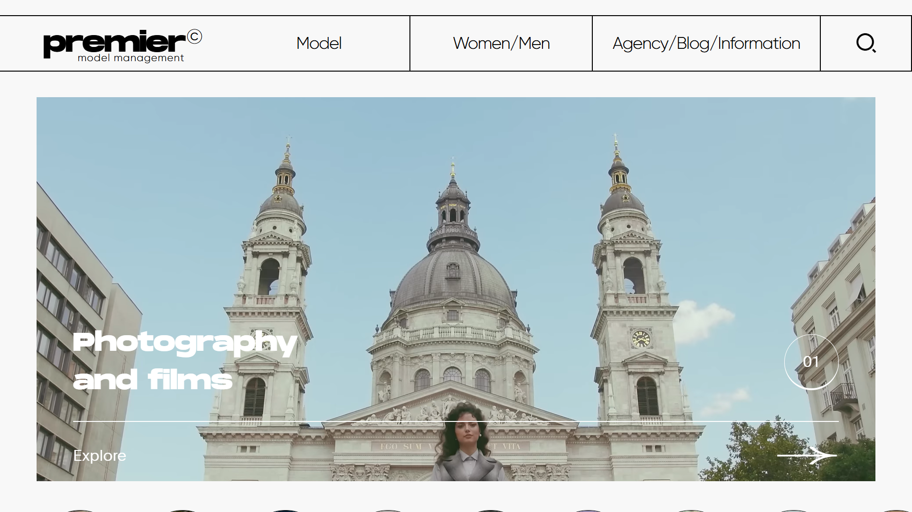
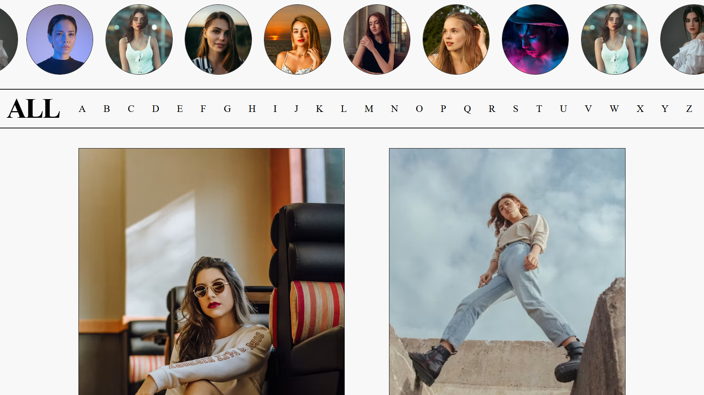
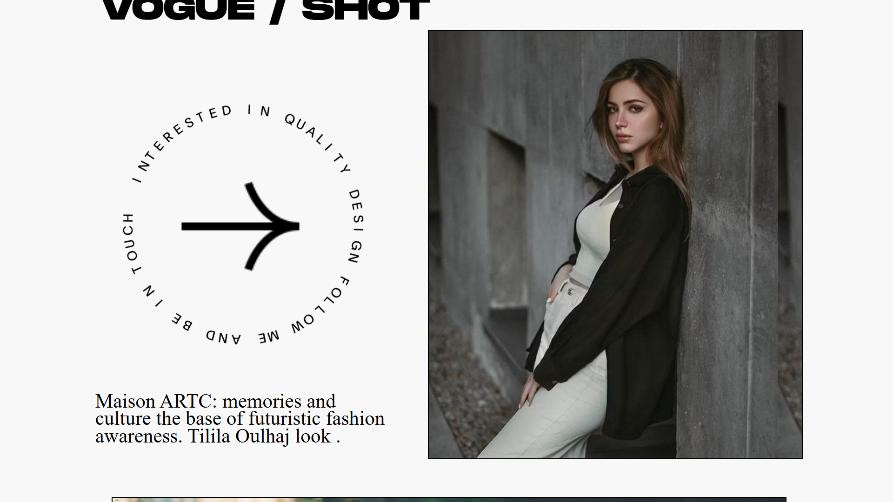
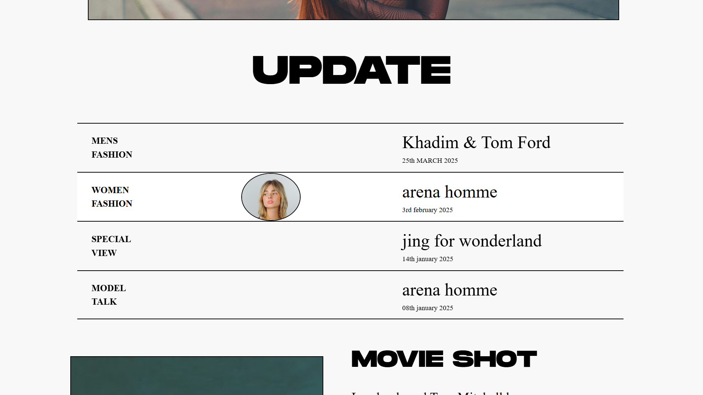
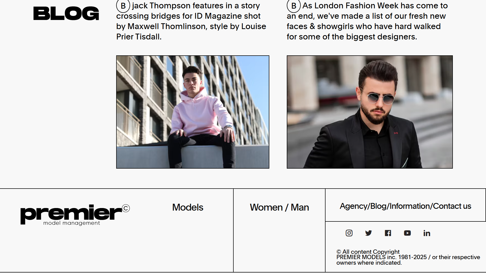

# 🎨 Behance Frontend Clone



A pixel-perfect frontend clone inspired by Behance's modern portfolio showcase design. This project focuses on creating a visually appealing, responsive, and interactive user experience using modern frontend development practices.

## 🌐 Live Demo

🔗 **Live Website:** https://behance-clone-aditayan.netlify.app/

---

## 📌 Overview

This project recreates the core visual experience of Behance, featuring a modern portfolio-style interface with smooth interactions, responsive layouts, and engaging animations.

### Key Highlights

* Modern and clean UI
* Smooth scrolling experience
* Interactive animations
* Fully responsive design
* Portfolio-style content showcase
* Professional visual hierarchy
* Optimized user experience

The primary goal of this project was to strengthen frontend development skills while focusing on design accuracy, responsiveness, and UI implementation.

---

## 🛠️ Tech Stack

### Frontend

* HTML5
* CSS3
* JavaScript (ES6+)

### Design & Animation

* CSS Animations
* Responsive Layout Techniques
* Custom Hover Effects
* Interactive UI Components

### Deployment

* Netlify

---

## ✨ Features

### 🎯 Modern Landing Page

* Responsive navigation
* Professional typography
* Clean and structured layout

### 🎨 Portfolio Showcase

* Behance-inspired project cards
* Interactive content sections
* Elegant visual presentation

### 📱 Fully Responsive

* Mobile Friendly
* Tablet Optimized
* Desktop Responsive

### ⚡ Performance Focused

* Lightweight assets
* Fast loading experience
* Optimized layout rendering

### 🎭 Smooth User Experience

* Hover interactions
* Transition effects
* Seamless page flow

---

# 📸 Project Screenshots

## 🏠 Home Page


---

## 📂 Content Section 1



---

## 📂 Content Section 2



---

## 📂 Content Section 3



---

## 🔻 Footer Section



---

## 📁 Project Structure

```bash
Behance-Frontend-Clone/
│
├── assets/
│   ├── home.png
│   ├── content1.png
│   ├── content2.png
│   ├── content3.png
│   └── footer.png
│
├── index.html
├── style.css
├── script.js
└── README.md
```

---

## 🚀 Getting Started

### Clone Repository

```bash
git clone https://github.com/Aditayan-patel/Behance-Frontend-clone.git
```

### Navigate to Project Directory

```bash
cd Behance-Frontend-clone
```

### Run Locally

Open the project using:

```bash
index.html
```

Or use VS Code Live Server:

```bash
Right Click → Open with Live Server
```

---

## 🎯 Learning Outcomes

Through this project, I enhanced my understanding of:

* Responsive Web Design
* Layout Structuring
* Modern CSS Techniques
* Frontend Animation
* UI/UX Principles
* Design Replication
* Performance Optimization

---

## 👨‍💻 Author

### Aditayan Patel

* GitHub: https://github.com/Aditayan-patel
* Portfolio: https://behance-clone-aditayan.netlify.app/

---

## ⭐ Support

If you found this project helpful, consider giving it a star ⭐ on GitHub.

Your support helps showcase the project and motivates future development.

---

<div align="center">

### 🚀 Made with ❤️ by Aditayan Patel

Frontend Developer • MERN Stack Developer • UI/UX Enthusiast

</div>

---

### Disclaimer

This project is created for educational and portfolio purposes only. All design inspirations belong to Behance and their respective creators.
